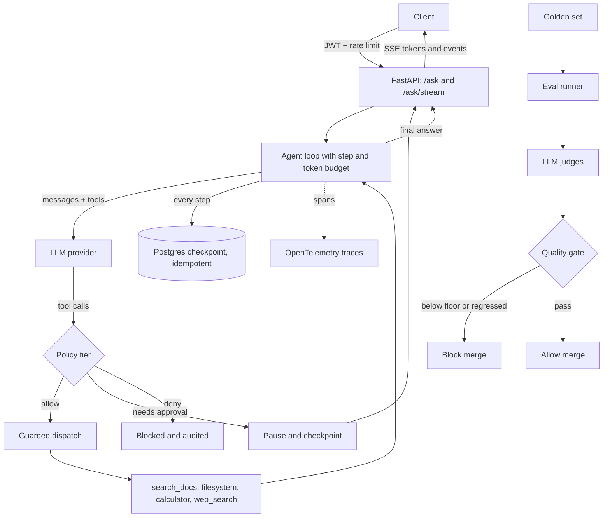

# Hangul

**A production-grade agent harness for grounded, auditable document Q&A.**

[](https://github.com/aasimmalikin/hangul-harness/actions/workflows/ci.yml)


Hangul is an LLM agent harness that treats the hard parts of shipping an agent as first-class concerns: **evaluation, governance, durability, and observability**. The tool-calling loop is the easy 20 percent of an agent. Hangul is built around the other 80 percent, the parts that decide whether an agent can be trusted, deployed, and proven safe to change.

---

## Why this exists

Most agent projects stop the moment the loop calls a tool and returns an answer. That is where the interesting engineering actually starts. An answer you cannot trace, a tool call you cannot govern, a run you cannot resume, and a quality number you cannot defend are all liabilities the day you put an agent in front of real users.

Hangul is organized around four questions a reviewer of any production agent will ask, and every section of this README maps to one of them:

1. **Can I trust the answer?** Grounded retrieval plus faithfulness and correctness scoring.
2. **Can I control what it does?** Tiered tool policy with human approval and an audit trail.
3. **Will it survive the real world?** Durable, idempotent, resumable execution.
4. **Can I see and measure it?** OpenTelemetry tracing and a CI quality gate.

The rest of this document walks that path in order, from what the agent does, to how a request flows through it, down to how a change is blocked from merging if it makes the agent worse.

## What it does

At the surface, Hangul answers questions over a user's own material: a private document library and the files they upload into a session workspace. To do that reliably it exposes a small, deliberate tool surface, and its system prompt forces the agent to pick the right one and to cite its source every time:

- **`search_docs`** for semantic retrieval over the document library, the only path to that library.
- **`filesystem`** tools (wired over MCP) for listing and reading session workspace files.
- **`calculator`** for every arithmetic step, so numbers are never hallucinated.
- **`web_search`** for information the user's own material cannot contain.
- **`ask_user`** to pause and disambiguate, used rarely and only when the outcome depends on it.

Because the agent is told to prefer the fewest tool calls that reach a cited answer, grounding is a design goal rather than an afterthought. That grounding is exactly what the evaluation layer later measures, which is why retrieval and evaluation are two ends of the same idea in this codebase.

## Architecture at a glance

Everything above runs through a single, observable request lifecycle. A question enters over an authenticated API, moves through the agent loop where each tool call is checked against policy, is persisted at every step so it can be resumed, and streams back token by token. An offline evaluation path guards the whole thing in CI.



The sections that follow zoom into each stage of this diagram, in the order a request travels through it.

## The agent loop

The core is an async tool-calling loop (`src/harness/agent/loop.py`) built directly on OpenAI-compatible function calling through a provider abstraction, so the model behind it is swappable. Each turn, the model either produces a final answer or requests tools; the loop dispatches them, appends the results, and continues until the question is answered or a budget is reached.

Two properties make it production-shaped rather than a demo. First, every run is bounded by an explicit **step and token budget**, so a confused agent stops instead of looping forever or burning the context. Second, the loop **streams every turn**, not just the last one, emitting structured events (`step`, `text_delta`, `tool_call`, `tool_result`) over Server-Sent Events so a caller can watch the agent reason in real time. When a tool errors, the result tells the model not to retry the identical call and to try another approach, which keeps the loop from thrashing.

A loop that can call tools on a user's behalf is only as safe as the guardrails around it, which is the next layer.

## Governance and human-in-the-loop

Before any tool runs, its name is resolved to a **policy tier** and turned into a decision (`src/harness/policy/`). The model never gets to act outside these rails:

| Tier | Decision |
| --- | --- |
| `safe`, `sensitive` | allow |
| `destructive`, `elicit` | pause for human approval |
| `denied` | block |

When a call needs approval, the loop does something most toy agents skip: it runs the safe calls that came before it, saves the pending call, writes valid placeholder history so the conversation stays consistent, and returns control to the caller. A human approves through a dedicated endpoint, and the run resumes exactly where it paused. Every dispatch passes through a guarded path that writes to an **audit log**, so there is always a record of what was attempted and what was allowed.

Access to all of this is gated by **JWT bearer auth** with role-based access (`user` and `admin`) and **Redis-backed token revocation** by `jti`, alongside per-caller rate limiting. Governing what the agent does is only half the problem; the run itself also has to survive interruption, which is what the durability layer handles.

## Durable, exactly-once execution

Agents fail, deploys restart, and users close tabs mid-run. Hangul persists the full state of every run to Postgres as a checkpoint (`threads` table: messages, step, status, completed calls, and any pending tool), so a run can be **resumed from the exact step it stopped** rather than restarted from scratch.

The same checkpoint makes tool execution **idempotent**. Each call is keyed by thread, tool name, and arguments; if a resumed run replays a call that already completed, the stored result is returned instead of executing it again. Paired with a **transactions ledger** (`db/ledger.py`) that records cost against a running balance, this means a resumed or retried run never double-executes a side effect and never double-charges. Durability protects the run; the next layer is about what the run is actually reasoning over.

## Retrieval

The answers the agent is graded on are only as good as what it retrieves, so retrieval is a full pipeline rather than a single call (`src/harness/retrieval/`). Documents are chunked, embedded, and served from a vector store, with **index versioning** so a re-ingest cannot silently mix old and new content, and **per-session stores** so a user's uploaded files stay isolated to their session. The session filesystem is exposed through an MCP server wired at startup, which keeps the harness honest about the boundary between the shared library and a user's private workspace.

Retrieval is where trust is earned. The remaining two layers are where it is proven, first by making every run visible, then by measuring it.

## Observability

You cannot govern or improve what you cannot see. Hangul instruments the loop with **OpenTelemetry spans** that follow the GenAI semantic conventions (`agent.run`, `gen_ai.chat`, `gen_ai.tool.execute`), recording input and output token usage per turn as span attributes. Traces land in a store behind dedicated `/observability` and `/quality` endpoints, and the load-testing scripts under `scripts/` let you measure latency and observability overhead under concurrency. Every claim the evaluation layer makes about quality is therefore backed by a trace you can open and inspect.

## Evaluation and the CI quality gate

This is the layer Hangul is built to showcase, and it closes the loop opened at the top of this README: it turns "can I trust the answer" into a number that blocks a merge.

Answers are scored by **LLM-as-judge graders** (`src/harness/eval/graders.py`) for two things that matter most in grounded Q&A:

- **Faithfulness**: is every claim in the answer supported by the retrieved context, or did the agent hallucinate?
- **Correctness**: how well does the answer match a reference?

The graders sit behind a `Judge` **Protocol**, so a real model judge and a deterministic fake judge are interchangeable, which keeps the eval suite fast and reproducible in CI. Tool interactions can be recorded and replayed through a **cassette** layer for the same reason.

Those scores feed a **CI quality gate** (`src/harness/eval/gate.py`) that does what a reviewer would do by hand, automatically. It fails a build when average faithfulness, average correctness, or pass rate drop below a floor, and it compares against a baseline to catch **regressions**, separating a real drop from noise with a margin so small dips are advisory rather than blocking. In short, a change that makes the agent less grounded does not merge.

## Tech stack

Pulling the layers together, Hangul runs on a deliberately production-oriented stack:

- **Core:** Python 3.11+, async throughout, OpenAI-compatible provider interface, MCP for external tools.
- **API:** FastAPI with SSE streaming, JWT auth, rate limiting.
- **State:** PostgreSQL with Alembic migrations for checkpoints, users, and the cost ledger; Redis for caching and token revocation.
- **Ops:** Docker and Docker Compose, GitHub Actions CI, Terraform for AWS (ALB, RDS, ElastiCache), and load tests with Locust.

## Quickstart

```bash
git clone https://github.com/aasimmalikin/hangul-harness.git
cd hangul-harness

cp .env.example .env          # set your model API key and secrets
docker compose up -d          # Postgres + Redis
pip install -e .              # or: pip install -r requirements.txt
alembic upgrade head          # apply migrations

uvicorn harness.api.app:app --reload
```

Then open the interactive API docs at `http://localhost:8000/docs`, or run the evaluation suite and quality gate on their own:

```bash
python run_evals.py
```

## Project layout

```
src/harness/
  agent/        tool-calling loop, budget, checkpointer, state
  policy/       tiered tool policy, guarded dispatch, audit, budget
  checkpoint/   durable + idempotent run persistence
  retrieval/    chunking, embeddings, ingest, index versioning, session stores
  tools/        builtin tools, registry, tiers, cassette record/replay
  mcp/          MCP client, manager, supervisor, schema snapshot
  obs/          OpenTelemetry tracing, spans, trace store
  eval/         LLM-judge graders, eval runner, CI quality gate
  providers/    LLM provider abstraction (OpenAI-compatible)
  api/          FastAPI app, auth, rate limiting, routes (ask, approve, stream, ...)
  db/           SQLAlchemy models and cost ledger
evals/          golden datasets, judges, metrics, calibration labels
infra/          Terraform for AWS
scripts/        load tests and latency/observability measurement
```

## Roadmap

Hangul is under active development. The engine described above is working; the layers being built out next are:

- Expanding the golden evaluation set and wiring the standalone retrieval and tool-use metrics into the gate.
- Trajectory-level evaluation via Inspect, beyond final-answer scoring.
- Calibrating the LLM judges against the human-labeled set for agreement measurement.
- Context compaction so long runs degrade gracefully instead of hitting the token budget, and a self-verification step that checks groundedness before returning.

## License

Released under the MIT License. See [`LICENSE`](./LICENSE).
