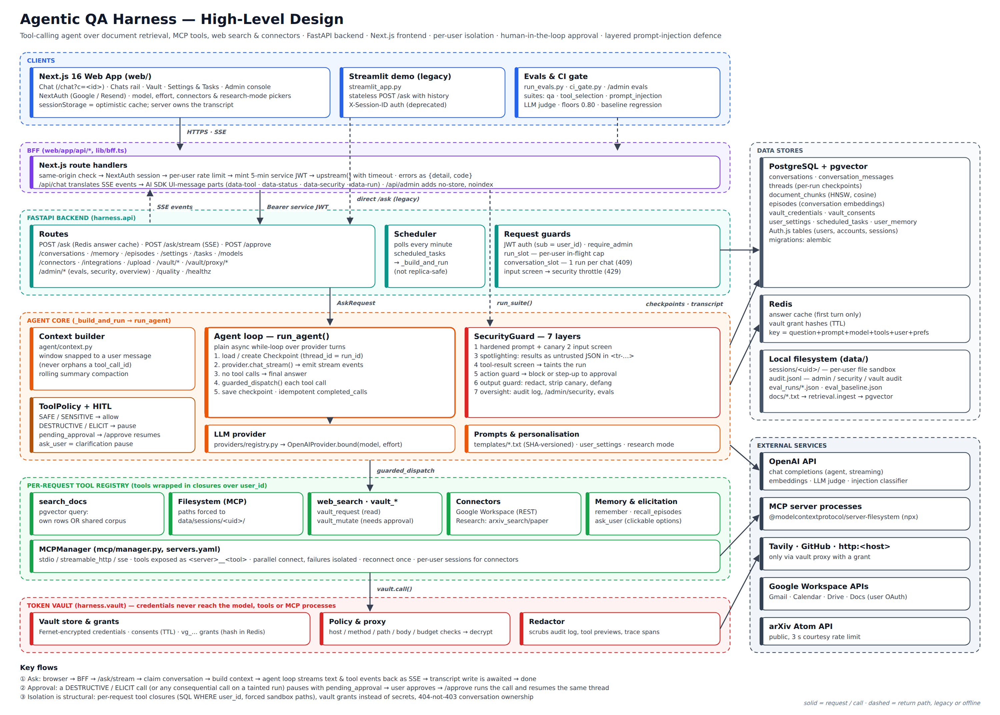
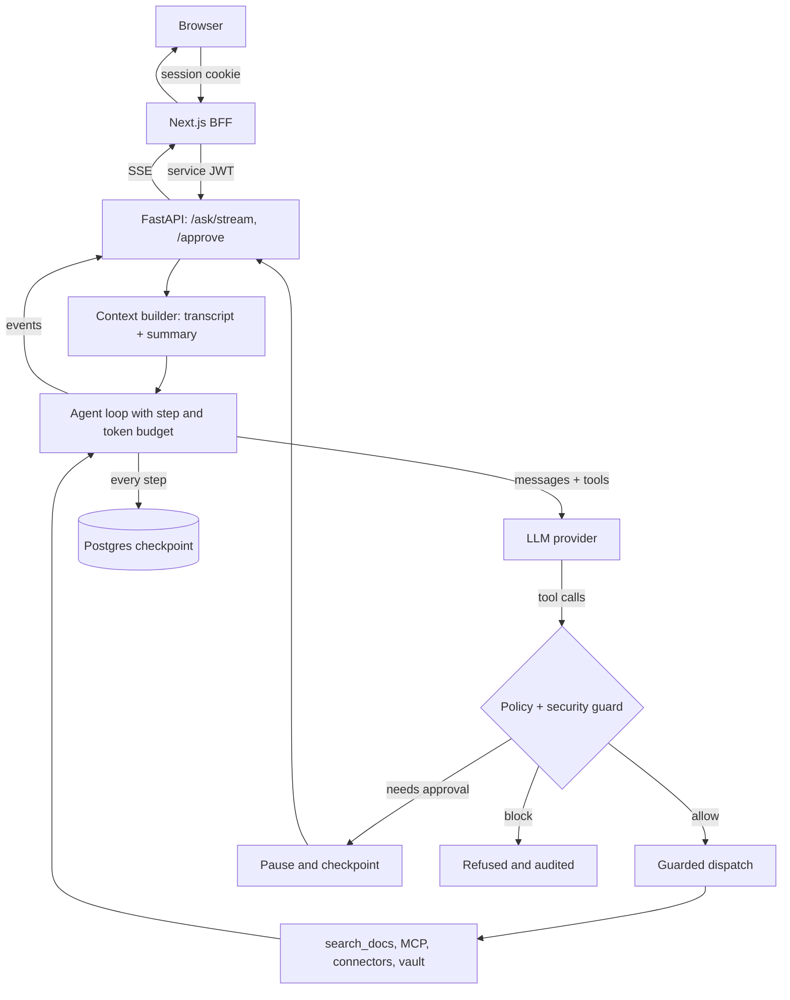

# Hangul

**A production-grade agent harness for grounded, auditable document Q&A.**

[](https://github.com/aasimmalikin/hangul-harness/actions/workflows/ci.yml)


Hangul is an LLM agent harness that treats the hard parts of shipping an agent as first-class concerns: **evaluation, governance, durability, security, and observability**. The tool-calling loop is the easy 20 percent of an agent. Hangul is built around the other 80 percent, the parts that decide whether an agent can be trusted, deployed, and proven safe to change.

It ships as a complete, runnable system: a FastAPI backend with the agent loop, a Next.js chat app, Postgres + pgvector for retrieval and state, and Redis for caching.



**Contents:** [Features](#features) · [Quickstart](#quickstart) · [Configuration](#configuration) · [Troubleshooting](#troubleshooting) · [How it works](#how-it-works) · [Evaluation](#evaluation-and-the-quality-gate) · [Testing](#testing) · [Deployment](#deployment) · [Project layout](#project-layout)

---

## Features

**Chat and agent**
- Streaming chat UI (Next.js) that shows the agent's narration, each tool call as it is drafted, and its result.
- Server-owned conversations: multi-turn context with automatic compaction of older turns; a chat reopens on any device.
- Per-request model and reasoning-effort picker; **Deep research** mode that plans, searches docs, web and arXiv, and cites sources.
- Personalisation (name, tone, timezone, custom instructions) and **scheduled tasks** that run a question on a timer.

**Tools**
- `search_docs`: semantic retrieval over a shared document library plus each user's own uploads (pgvector).
- Filesystem tools over **MCP**, sandboxed to the user's own folder.
- `calculator`, `web_search` (Tavily), long-term memory (`remember` / `recall`), past-chat recall, and `ask_user` for clarifying questions with clickable options.
- **Connectors** switched on per chat: Google Workspace (Gmail, Calendar, Drive, Docs) and Research (arXiv).
- Any MCP server (stdio, streamable HTTP or SSE) can be added in [`servers.yaml`](src/harness/mcp/servers.yaml).

**Governance and safety**
- Tiered tool policy: destructive actions (sending mail, writing files, …) **pause for human approval** in the UI and resume exactly where they stopped.
- **Token vault**: third-party credentials are encrypted and never reach the model, a tool, or an MCP process; every outbound call goes through a policy-checked proxy.
- **Seven-layer prompt-injection defence**: hardened prompt with canary, input screening, spotlighting of tool results, result screening with run tainting, action guard, output guard, and audit.
- Per-user isolation built into the queries and paths themselves, not the prompt.
- Admin console (Google sign-in + allowlist) for evals, security events and usage.

**Durability and quality**
- Every run is checkpointed to Postgres; tool calls are idempotent, so a resumed run never repeats a side effect.
- Tracing of every run, model call and tool call, with token usage and cost.
- Three eval suites (answer quality, tool selection, prompt injection) with an LLM judge and a regression gate.

---

## Quickstart

About 15 minutes the first time. You will run three things side by side: the databases (Docker), the API (Python), and the web app (Node).

### 0. Prerequisites

| You need | Version | Check with |
| --- | --- | --- |
| Python | 3.12+ | `python3 --version` |
| Node.js (also runs the MCP filesystem server) | 20.9+ | `node --version` |
| Docker with Compose | any recent | `docker compose version` |
| An OpenAI API key | | [platform.openai.com/api-keys](https://platform.openai.com/api-keys) |
| A Google account (for signing in) | | |

### 1. Clone and install

```bash
git clone https://github.com/aasimmalikin/hangul-harness.git
cd hangul-harness

python3 -m venv .venv
source .venv/bin/activate            # Windows: .venv\Scripts\activate
pip install -e ".[dev]"

cd web && npm install && cd ..
```

### 2. Create your config files

```bash
cp .env.example .env
cp web/.env.example web/.env.local
```

Generate two secrets:

```bash
python -c "import secrets; print(secrets.token_urlsafe(48))"   # shared API secret
openssl rand -base64 32                                          # web session secret
```

Then fill in these values. Everything else can stay as it is for now.

| File | Key | Value |
| --- | --- | --- |
| `.env` | `openai_api_key` | your OpenAI key |
| `.env` | `jwt_secret` | the first secret |
| `web/.env.local` | `FASTAPI_JWT_SECRET` | **the same** first secret |
| `web/.env.local` | `AUTH_SECRET` | the second secret |

> `jwt_secret` and `FASTAPI_JWT_SECRET` must be identical. If they differ, every chat request fails with 401.

### 3. Set up Google sign-in (5 minutes)

The web app needs a sign-in provider. Google is the quickest:

1. Open [Google Cloud Console → APIs & Services](https://console.cloud.google.com/apis/credentials) and create (or pick) a project.
2. **OAuth consent screen**: choose *External*, fill in the app name and your email, and under *Test users* add the Google account you will sign in with.
3. **Credentials → Create credentials → OAuth client ID**: type *Web application*, and add this **Authorized redirect URI**:
   ```
   http://localhost:3000/api/auth/callback/google
   ```
4. Copy the client ID and secret into `web/.env.local` as `AUTH_GOOGLE_ID` and `AUTH_GOOGLE_SECRET`.

Prefer email links? Fill in `AUTH_RESEND_KEY` and `AUTH_EMAIL_FROM` instead (see [Configuration](#configuration)).

### 4. Start the databases and create the tables

```bash
docker compose up -d        # Postgres (with pgvector) on 5432, Redis on 6379
alembic upgrade head        # creates all tables, including the sign-in tables
```

### 5. Build the document index

The agent answers from the documents in [`docs/`](docs/). Embed them once (a few cents of OpenAI usage):

```bash
python -m harness.retrieval.ingest docs
```

Put your own `.txt` files in `docs/` and re-run this command to search them instead. Users can also upload files from the chat.

### 6. Run it

In two terminals (activate the virtualenv in the first):

```bash
# terminal 1: API
uvicorn harness.api.app:app --reload --port 8000

# terminal 2: web app
cd web && npm run dev
```

### 7. Try it

1. Open **http://localhost:3000** and sign in with Google.
2. Ask something about the sample docs, e.g. *"How long are appointment slots at the clinic, and what was last quarter's no-show rate?"*. You should see the agent call `search_docs` and answer (20 minutes, 12 percent) with a citation.
3. Ask it to *"write a file called summary.txt with a two-line summary"*. It pauses and shows an **approval card**; approve it and the run continues.

Health check: `curl http://localhost:8000/healthz` returns `"status": "ok"` and the state of each MCP server. API docs are at http://localhost:8000/docs.

**Next steps:** turn on web search, the vault, or the admin console in [Configuration](#configuration).

---

## Configuration

The backend reads `.env` and the web app reads `web/.env.local`. Both example files explain every key. Most features are optional and switch off cleanly when their keys are empty:

| To enable | Set | Where |
| --- | --- | --- |
| **Required:** the agent | `openai_api_key` | `.env` |
| **Required:** API ↔ web trust | `jwt_secret` = `FASTAPI_JWT_SECRET` | both |
| **Required:** sessions | `AUTH_SECRET`, `AUTH_PG_URL` | `web/.env.local` |
| Google sign-in | `AUTH_GOOGLE_ID`, `AUTH_GOOGLE_SECRET` | `web/.env.local` |
| Email sign-in (magic link) | `AUTH_RESEND_KEY`, `AUTH_EMAIL_FROM` | `web/.env.local` |
| Token vault (the **Vault** page, `vault_*` tools) | `vault_master_key` | `.env` |
| Web search | `tavily_api_key` **and** `vault_master_key` | `.env` |
| Google Workspace connector | `auth_google_id`, `auth_google_secret` (same values as the web app) | `.env` |
| Admin console at `/admin` | `admin_emails` (your Google email) | `.env` |
| Model-based injection screen | `security_llm_screen = true` | `.env` |

Generate a vault key with:

```bash
python -c "from cryptography.fernet import Fernet; print(Fernet.generate_key().decode())"
```

Notes:
- **Email sign-in with Resend:** until you verify a domain in Resend, use `AUTH_EMAIL_FROM=onboarding@resend.dev`; Resend then only delivers to the email address of your Resend account.
- **Admin console:** only works for Google sign-ins made within the last 12 hours by an address in `admin_emails`. Empty `admin_emails` disables it.
- **Your own database:** any Postgres 14+ with the [`pgvector`](https://github.com/pgvector/pgvector) extension available works (Neon, Supabase and RDS all do). Point `database_url` (`postgresql+psycopg://…`) and `AUTH_PG_URL` (`postgresql://…`) at the same database.
- **MCP servers:** add or remove them in [`src/harness/mcp/servers.yaml`](src/harness/mcp/servers.yaml). `${VAR}` values are read from the environment, and `vault:<provider>` hands the server a short-lived grant instead of a real token.
- **Production:** set `environment = "prod"`. The API then refuses to start unless `jwt_secret` is a random value of at least 32 characters.

---

## Troubleshooting

| Symptom | Fix |
| --- | --- |
| Every chat message fails with 401 / "unauthorized" | `jwt_secret` (`.env`) and `FASTAPI_JWT_SECRET` (`web/.env.local`) differ. Make them identical and restart both. |
| The agent says it found nothing in the documents | The index is empty: run `python -m harness.retrieval.ingest docs`. |
| `alembic upgrade head` fails with `type "vector" does not exist` | Your Postgres lacks pgvector. Use the `docker compose` database or install the extension. |
| `docker compose up` fails on port 5432 or 6379 | A local Postgres or Redis already uses the port. Stop it, or change the left-hand port in `docker-compose.yml` and in the URLs. |
| Google: `redirect_uri_mismatch` | The redirect URI must be exactly `http://localhost:3000/api/auth/callback/google`. |
| Google: "Access blocked" / `access_denied` | Add your account under *Test users* on the OAuth consent screen. |
| `/healthz` shows the `filesystem` MCP server as `failed` | Node/`npx` is missing from the API's PATH. Install Node 20.9+ and restart the API. |
| Web search answers `VAULT_UNAVAILABLE` | Set `vault_master_key` and `tavily_api_key` in `.env`, then restart the API. |
| `/admin` says you are not an administrator | Add your email to `admin_emails`, restart the API, and sign in again with Google. |
| The API won't start: `JWT_SECRET must be set …` | You set `environment = "prod"`; generate a real `jwt_secret` (step 2). |

---

## How it works

A question enters the web app, passes through a thin backend-for-frontend (`web/app/api/*`) that checks the session and mints a short-lived service token, and reaches FastAPI. There it runs through the agent loop, where every tool call is checked against policy and security, every step is checkpointed, and every event streams back to the browser over Server-Sent Events.



### The agent loop

The core is an async tool-calling loop ([`agent/loop.py`](src/harness/agent/loop.py)) over OpenAI-compatible function calling behind a provider abstraction, so the model is swappable. Each turn the model either answers or requests tools; the loop dispatches them, appends the results, and continues until the question is answered or a budget is reached.

Every run is bounded by an explicit **step and token budget** set by the chosen reasoning effort, so a confused agent stops instead of looping. The loop **streams every turn**, not just the last, emitting structured events (`text_delta`, `tool_pending`, `tool_call`, `tool_result`, `approval_required`, …) so the user watches the agent work in real time.

### Conversations

A conversation is a durable, server-side transcript stored in OpenAI wire format, so later turns still see what earlier turns retrieved. The context builder keeps a window of recent turns (never splitting a tool call from its result) and folds older ones into a rolling summary. A conversation runs one request at a time, so two tabs can't corrupt the transcript.

### Governance and human-in-the-loop

Before any tool runs, its name is resolved to a **policy tier** ([`policy/`](src/harness/policy/)):

| Tier | Decision |
| --- | --- |
| `safe`, `sensitive` | allow |
| `destructive`, `elicit` | pause for human approval |
| anything else | block |

When a call needs approval, the loop runs the calls before it, records the pending one, writes valid placeholder history, and returns. The user approves in the chat, and the run resumes exactly where it paused. Every dispatch is written to an **audit log**.

### Security

Tool results are the main way untrusted text reaches the model, so Hangul treats them as data, not instructions. Results are wrapped in marked, per-thread boundaries; screened for injection patterns (and optionally by a classifier model); and a hit **taints** the run, after which any consequential action (web, vault, file writes, memory) needs approval. Arguments carrying a secret or the per-thread canary are refused outright, and the final answer is redacted and defanged before it is shown. Credentials live in the **token vault** and are only ever decrypted inside its proxy. Details are in [`security/`](src/harness/security/) and [`vault/`](src/harness/vault/).

### Durable, exactly-once execution

The full state of every run is checkpointed to Postgres (messages, step, status, completed calls, pending tool), so a run resumes from the exact step it stopped. Each tool call is keyed by thread, name and arguments; a resumed run replays the stored result instead of executing again. Paired with a cost ledger ([`db/ledger.py`](src/harness/db/ledger.py)), a retried run never double-executes a side effect or double-charges.

### Retrieval and isolation

Documents are chunked, embedded and stored in Postgres (`document_chunks`, HNSW index) with **index versioning**. Isolation is structural: each request gets its own tool instances bound to the user, so `search_docs` filters by `user_id` in SQL (falling back to the shared library) and file tools rewrite every path into `data/sessions/<user_id>/`, whatever path the model invents.

### Observability

The loop is traced with a lightweight in-process tracer ([`obs/tracing.py`](src/harness/obs/tracing.py)) whose spans follow the OpenTelemetry GenAI naming conventions (`agent.run`, `gen_ai.chat`, `gen_ai.tool.execute`) and record token usage and cost per turn. The last 200 traces are kept in memory and served, with latency and cost metrics, to the admin console (so they reset on restart and are per replica). Exporting to an OpenTelemetry collector is not wired up yet. [`scripts/`](scripts/) holds Locust and latency load tests.

---

## Evaluation and the quality gate

> Evals call the real agent and an OpenAI judge, so **every run costs money**. Start with `--limit 5`.

| Suite | Data | What it measures |
| --- | --- | --- |
| `qa` | [`data/evalset.jsonl`](data/evalset.jsonl) | Faithfulness (is every claim supported by retrieved context?) and correctness vs a reference |
| `tool_selection` | [`data/evalsets/tool_selection.jsonl`](data/evalsets/tool_selection.jsonl) | Right tools, no unneeded or forbidden calls, correct arguments, approval compliance, no invented actions, cost |
| `prompt_injection` | [`data/evalsets/prompt_injection.jsonl`](data/evalsets/prompt_injection.jsonl) | Attack success, secret leaks, detection and task completion with a poisoned tool result |

```bash
python run_evals.py --limit 5                           # qa suite -> data/eval_runs/eval-<stamp>.json
python run_evals.py --suite tool_selection --limit 5    # -> data/eval_runs/tool_selection-<stamp>.json
python ci_gate.py                                       # exit 1 if below floors or regressed
```

The **quality gate** ([`eval/gate.py`](src/harness/eval/gate.py)) fails when average faithfulness, correctness or pass rate drops below 0.80, or regresses by more than 0.05 against [`data/eval_baseline.json`](data/eval_baseline.json). Judges sit behind a `Judge` protocol, so a deterministic fake judge can replace the model one.

The gate runs **locally or on demand**; the included GitHub workflow only lints and checks imports, to avoid spending API credits on every push. To enforce it on pull requests, add an `OPENAI_API_KEY` repository secret and a job that runs `python ci_gate.py`. Results also show on the admin console.

---

## Testing

```bash
pytest tests/unit                      # backend unit tests: no database, network or API key needed

cd web
npx playwright install chromium        # once
npm run test:e2e                       # builds the app, then runs Playwright against a fake backend
npm run lint

ruff check src/                        # from the repo root
```

The end-to-end tests use a stand-in FastAPI ([`web/tests/e2e/fake-backend.mjs`](web/tests/e2e/fake-backend.mjs)) that can be told to fail in specific ways, so they need no real backend or keys.

---

## Deployment

The API and the web app deploy separately.

**API (Docker):**

```bash
docker build -t hangul-harness .
docker run --env-file .env -p 8000:8000 hangul-harness
```

The image includes Node for the MCP filesystem server. Its default command (`start.sh`) also starts the legacy Streamlit demo on 8501; run `uvicorn harness.api.app:app --host 0.0.0.0 --port 8000` instead if you only want the API. Run `alembic upgrade head` against the production database before the first start. [`scripts/smoke_test.sh <url>`](scripts/smoke_test.sh) checks `/healthz` and `/ask` after a deploy.

**Web app:** `cd web && npm run build && npm start`, or deploy `web/` to Vercel. Set every key from `web/.env.example`, point `FASTAPI_URL` at the API, and behind a proxy set `AUTH_URL` (your public URL) and `AUTH_TRUST_HOST=true`. Add `https://<your-domain>/api/auth/callback/google` to the Google OAuth client.

**Production checklist:**
- `environment = "prod"` with a strong `jwt_secret` (the API refuses weak ones), and the same value as the web app's `FASTAPI_JWT_SECRET`.
- Your own `vault_master_key`; keep it safe, since losing it makes stored credentials unreadable.
- With more than one API replica, set `scheduler_enabled = false` on all but one; otherwise every replica runs each scheduled task.
- `vault_public_url` must be an address MCP server processes can reach.
- [`infra/terraform/`](infra/terraform/) is a reference AWS setup (ALB, EC2, RDS, ElastiCache). Replace its project name, image URI and key names with your own before applying.

---

## Project layout

```
src/harness/
  agent/         tool-calling loop, context builder (window + compaction)
  api/           FastAPI app, auth, concurrency, routes (ask, stream, approve, conversations, ...)
  policy/        tiered tool policy, guarded dispatch, audit
  security/      prompt-injection defence (detector, spotlighting, guards)
  vault/         encrypted credentials, grants, outbound proxy, redaction
  connectors/    per-chat tool sources (Google Workspace, arXiv)
  integrations/  Google OAuth token refresh
  mcp/           MCP client, manager, servers.yaml
  tools/         builtin tools and registry
  retrieval/     chunking, embeddings, ingest, pgvector store
  checkpoint/    durable, idempotent run persistence
  eval/          suites, graders, trajectories, quality gate
  providers/     LLM provider abstraction and model registry
  obs/           run tracing (GenAI span conventions), trace store
  db/            SQLAlchemy models, settings, tasks, cost ledger
  prompts/       versioned prompt templates
  scheduler.py   scheduled tasks
web/             Next.js app: chat, vault, settings, admin, and the BFF (app/api/*)
alembic/         database migrations
docs/            sample document library (indexed by retrieval.ingest)
data/            eval sets, baselines, reports; per-user sandboxes at runtime
tests/unit/      backend unit tests
infra/           reference Terraform for AWS
scripts/         load tests, latency measurement, smoke test
```

`streamlit_app.py` is a legacy demo that predates the web app's sign-in; it is not maintained.

---

## Tech stack

- **Backend:** Python 3.12, FastAPI (async, SSE), SQLAlchemy + Alembic, OpenAI-compatible providers, MCP.
- **Frontend:** Next.js 16, React 19, Auth.js, Vercel AI SDK, Playwright.
- **State:** PostgreSQL + pgvector for checkpoints, conversations, retrieval and credentials; Redis for the answer cache and vault grants.
- **Ops:** Docker, GitHub Actions, Terraform (AWS), Locust.

## Roadmap

- Run the quality gate in CI on pull requests.
- Migrate to the OpenAI Responses API (reasoning effort together with tools).
- Make the scheduler safe to run on multiple replicas.
- Trajectory-level evaluation via Inspect, and calibrating the LLM judges against a human-labelled set.
- A self-verification step that checks groundedness before answering.
- Export traces to an OpenTelemetry collector instead of keeping them in memory.

## Contributing

Issues and pull requests are welcome. Please run `pytest tests/unit` and `ruff check src/` before opening a PR, and `npm run lint` if you touched `web/`. For security issues, please open a private [security advisory](https://github.com/aasimmalikin/hangul-harness/security/advisories/new) instead of a public issue.

## License

Released under the MIT License. See [`LICENSE`](LICENSE).
