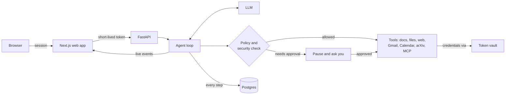

<a name="readme-top"></a>

<div align="center">
  <h1>Hangul</h1>
  <p><strong>A secure personal agent that researches, reads your documents and inbox, and takes action for you once you approve.</strong></p>
</div>

<p align="center">
  <a href="https://github.com/aasimmalikin/hangul/actions/workflows/ci.yml"></a>
  
  
  
  <a href="LICENSE"></a>
</p>

<p align="center">
  <a href="#quick-start">Quick start</a> ·
  <a href="#what-hangul-can-do">Features</a> ·
  <a href="#connect-your-accounts">Connect accounts</a> ·
  <a href="#security">Security</a> ·
  <a href="#how-it-fits-together">Architecture</a> ·
  <a href="#faq">FAQ</a>
</p>

<!-- Add a screenshot or short GIF of a chat with an approval card here, e.g.
<p align="center"></p> -->

---

Hangul is an open-source AI assistant for your working day that you host yourself. Ask it something and it searches the web, arXiv, your files and your Google Workspace, then answers with sources. Ask it to *do* something (reply to an email, book a meeting, update a doc) and it drafts the action and shows you exactly what will happen. Nothing leaves until you approve.

**Safe by design, not by prompt.** Approvals are enforced by a tool policy in code. Your credentials sit in an encrypted vault the model never sees. Emails, web pages and files are treated as untrusted input and screened for prompt injection. Every run is checkpointed, so an approval, crash or restart picks up exactly where it stopped.

## What Hangul can do

<table>
<tr><td><b>Research with sources</b></td><td>Searches the web and arXiv and cites what it used. <i>Deep research</i> mode plans several searches, reconciles conflicting sources and writes a referenced report.</td></tr>
<tr><td><b>Read your documents</b></td><td>Semantic search over a shared document library plus your own uploads (PDF, Markdown and text), stored in Postgres with pgvector.</td></tr>
<tr><td><b>Work in your inbox</b></td><td>Reads and searches Gmail, Calendar, Drive and Google Docs on your own account; drafts replies, events and document edits.</td></tr>
<tr><td><b>Act only with your approval</b></td><td>Sending mail, creating events, editing docs and writing files pause with a preview card. Approve and the run resumes; reject and nothing happens.</td></tr>
<tr><td><b>Remember you</b></td><td>Chats persist across devices, with older turns summarised automatically. It remembers facts you ask it to keep and follows your name, tone, timezone and custom instructions.</td></tr>
<tr><td><b>Work on a schedule</b></td><td>Run any question on an interval (every 15 minutes or more) or daily at a set time, for example a morning digest of your unread email.</td></tr>
<tr><td><b>Extend with MCP</b></td><td>Plug in any MCP server over stdio, streamable HTTP or SSE, and give it credentials through the vault instead of raw tokens.</td></tr>
<tr><td><b>Show its work</b></td><td>Streams its reasoning, each tool call as it's drafted, and each result, live in the chat.</td></tr>
<tr><td><b>Proven by evals</b></td><td>Suites for answer quality, tool selection and prompt-injection resistance, with a regression gate.</td></tr>
</table>

## Quick start

You need **Python 3.12+**, **Node.js 20.9+**, **Docker**, an [OpenAI API key](https://platform.openai.com/api-keys), and a Google account to sign in with.

**1. Install**

```bash
git clone https://github.com/aasimmalikin/hangul.git
cd hangul

python3 -m venv .venv && source .venv/bin/activate    # Windows: .venv\Scripts\activate
pip install -e ".[dev]"
(cd web && npm install)
```

**2. Configure**

```bash
cp .env.example .env
cp web/.env.example web/.env.local
python -c "import secrets; print(secrets.token_urlsafe(48))"    # secret A
openssl rand -base64 32                                          # secret B
```

| File | Key | Value |
| --- | --- | --- |
| `.env` | `openai_api_key` | your OpenAI key |
| `.env` | `jwt_secret` | secret A |
| `web/.env.local` | `FASTAPI_JWT_SECRET` | secret A (must match exactly) |
| `web/.env.local` | `AUTH_SECRET` | secret B |

**3. Create a Google sign-in client**

In [Google Cloud Console](https://console.cloud.google.com/apis/credentials), create a project. Set up the **OAuth consent screen** (type *External*) and add your account as a *Test user*. Then create an **OAuth client ID** of type *Web application*, with the redirect URI `http://localhost:3000/api/auth/callback/google`, and put its ID and secret in `web/.env.local` as `AUTH_GOOGLE_ID` and `AUTH_GOOGLE_SECRET`.

**4. Start the databases and index the sample documents**

```bash
docker compose up -d                        # Postgres (pgvector) and Redis
alembic upgrade head                        # create the tables
python -m harness.retrieval.ingest docs     # embed the sample docs in docs/
```

**5. Run**

```bash
uvicorn harness.api.app:app --reload --port 8000     # terminal 1: API
cd web && npm run dev                                # terminal 2: web app
```

Open **http://localhost:3000**, sign in, and try:

```text
How long are appointment slots at the clinic, and what was last quarter's no-show rate?
```

```text
Write a file called summary.txt with a two-line summary of the clinic handbook.
```

The first searches the sample documents and answers with a citation. The second stops at an approval card; approve it to watch the run continue.

<details>
<summary><b>Troubleshooting</b></summary>

| Symptom | Fix |
| --- | --- |
| Every message fails with 401 | `jwt_secret` and `FASTAPI_JWT_SECRET` differ. Make them identical and restart both. |
| It finds nothing in the documents | Run `python -m harness.retrieval.ingest docs`. |
| `type "vector" does not exist` during `alembic` | Your Postgres lacks pgvector; use the `docker compose` database. |
| Port 5432 or 6379 already in use | Stop the local Postgres/Redis, or change the port in `docker-compose.yml` and in the URLs. |
| Google: `redirect_uri_mismatch` | The redirect URI must be exactly `http://localhost:3000/api/auth/callback/google`. |
| Google: "Access blocked" | Add your account as a *Test user* on the consent screen. |
| `/healthz` shows `filesystem` as `failed` | Node/`npx` isn't on the API's PATH. Install Node and restart the API. |
| Web search says `VAULT_UNAVAILABLE` | Set `vault_master_key` and `tavily_api_key` (see below). |

</details>

## Connect your accounts

Everything below is optional and switches on after an API restart. Every key is documented in [`.env.example`](.env.example) and [`web/.env.example`](web/.env.example).

**Web search.** Add a [Tavily](https://tavily.com) key and a vault key to `.env`:

```bash
python -c "from cryptography.fernet import Fernet; print(Fernet.generate_key().decode())"
```

```ini
vault_master_key = <the key printed above>
tavily_api_key = tvly-...
```

**Gmail, Calendar, Drive and Docs.**
1. In your Google Cloud project, enable the Gmail, Google Calendar, Google Drive and Google Docs APIs.
2. Copy the Google client ID and secret into `.env` as `auth_google_id` and `auth_google_secret`.
3. In Hangul, open **Connected services** from the profile menu and click **Connect Google Workspace**.
4. In a chat, turn it on from **+ → Connectors → Google Workspace**, then ask: *"Summarise my unread email from today."*

**arXiv.** Turn on **+ → Connectors → Research** in any chat. No key needed.

**Admin console.** Add your Google email to `admin_emails` in `.env`, then open `/admin` for evals, security events and usage.

**Email sign-in.** Set `AUTH_RESEND_KEY` and `AUTH_EMAIL_FROM` in `web/.env.local` to use [Resend](https://resend.com) magic links instead of, or as well as, Google.

**Your own MCP servers.** Add them to [`src/harness/mcp/servers.yaml`](src/harness/mcp/servers.yaml). Use `vault:<provider>` in place of a token so the server only ever holds a short-lived grant.

## Security

Hangul reads content written by other people (emails, web pages, shared files) and can act on your accounts, so it assumes that content may be hostile:

- **Human approval.** Every tool has a policy tier. Anything that sends, creates, edits or deletes pauses for your approval, and the policy is code the model cannot argue with.
- **Token vault.** Third-party credentials are encrypted at rest and decrypted only inside the proxy that makes the outbound call, after host, method and budget checks. The model, the tools and MCP servers never hold a real token.
- **Prompt-injection defence in layers.** A hardened prompt with a per-conversation canary; screening of your messages; tool results wrapped as untrusted data; results screened for injection (a hit **taints** the conversation, and from then on every outbound action needs approval); arguments that carry a secret are refused; and answers are redacted before display. Every event is audited and shown on the admin console.
- **Per-user isolation.** Each request gets tools bound to the signed-in user: document search filters by user in SQL, and file tools can only reach that user's own folder.

Before exposing Hangul beyond your machine, read the [deployment checklist](#deployment).

## How it fits together



- **Web app** (`web/`): Next.js chat UI with sign-in. Its API routes check your session and forward each request with a five-minute service token.
- **API** (`src/harness/api/`): FastAPI. Loads your conversation, builds tools bound to you, and streams events back over SSE.
- **Agent loop** (`src/harness/agent/`): asks the model what to do, runs each tool call through the policy and security guard, and checkpoints every step, so a tool that already ran is never run twice.
- **Tools**: document search, sandboxed files over MCP, web search, memory, and the Google Workspace and arXiv connectors (`src/harness/connectors/`).
- **Vault** (`src/harness/vault/`) and **security** (`src/harness/security/`): the credential store and the prompt-injection defence described above.
- **Storage**: Postgres with pgvector for conversations, checkpoints, documents and credentials; Redis for the answer cache and vault grants.

## Evals

Three suites run the real agent and score it with an LLM judge. They call OpenAI, so each run costs money; start small.

```bash
python run_evals.py --limit 5                           # answer quality: correctness and faithfulness
python run_evals.py --suite tool_selection --limit 5    # right tools, right arguments, approvals respected
python ci_gate.py                                       # fail below 0.80 or on a regression vs the baseline
```

The `prompt_injection` suite poisons one tool result per case and measures attack success, leaks and detection. The gate runs locally; CI only lints, so pushes don't spend credits.

## Deployment

The API and web app deploy separately. Build the API with `docker build -t hangul .` (the image includes Node for MCP servers) and run `alembic upgrade head` against your database first. Deploy `web/` to Vercel or with `npm run build && npm start`, set `FASTAPI_URL` and `AUTH_URL`, and add your domain's `/api/auth/callback/google` to the Google client.

Before going live:
- Set `environment = "prod"`. The API refuses to start without a strong `jwt_secret`.
- Generate your own `vault_master_key` and back it up; without it, stored credentials can't be decrypted.
- With more than one API replica, set `scheduler_enabled = false` on all but one.
- Treat [`infra/terraform/`](infra/terraform/) as a reference AWS setup and replace its names and IDs with your own.

## FAQ

<details>
<summary><b>Which models does it support?</b></summary>

OpenAI models today: the GPT-5.x family (the default is `gpt-5.5`), GPT-6 Astra, and GPT-4.1. Users pick the model and reasoning effort per message. The provider sits behind an interface, so adding another provider is a contained change.
</details>

<details>
<summary><b>Where does my data go?</b></summary>

Conversations, documents, memories and credentials stay in your own Postgres. Prompts and retrieved content go to OpenAI to generate answers; search queries go to Tavily if you enable web search; and Google Workspace calls go directly to Google on your account.
</details>

<details>
<summary><b>Can it send an email without asking me?</b></summary>

No. Sending, drafting, creating events, editing docs and writing files all require approval, enforced by the tool policy rather than the prompt. If a conversation has ingested something that looks like an injection attack, every outbound action needs approval too.
</details>

<details>
<summary><b>Can I use it without Google?</b></summary>

Yes. Use Resend email sign-in instead, and the assistant still researches, searches your documents and files, and runs scheduled tasks. The Gmail, Calendar, Drive and Docs tools need a Google account.
</details>

<details>
<summary><b>Can several people use one deployment?</b></summary>

Yes. Every user has their own conversations, uploads, memories, credentials and file folder, isolated in the queries and paths themselves.
</details>

## Contributing

Issues and pull requests are welcome. Before opening a PR:

```bash
pytest tests/unit          # backend, no database or API key needed
ruff check src/
cd web && npm run lint && npm run test:e2e
```

Please report security issues through a private [security advisory](https://github.com/aasimmalikin/hangul/security/advisories/new), not a public issue.

## License

[MIT](LICENSE)

<p align="right"><a href="#readme-top">Back to top ↑</a></p>
