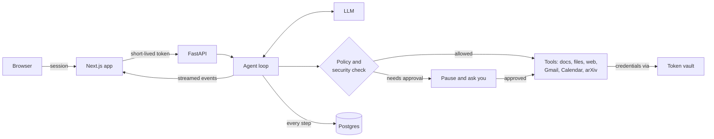

# hangul-harness

**Hangul: a secure personal agent that researches, reads your documents and inbox, and takes action for you once you approve.**

[](https://github.com/aasimmalikin/hangul-harness/actions/workflows/ci.yml)


hangul-harness is a self-hosted work assistant. You chat with it in the browser; it searches the web and arXiv, reads your files, Gmail, Calendar and Drive, and drafts the email, event or document you asked for. Anything that changes the outside world waits for your approval first.

It is built as a harness rather than a demo: every run is checkpointed and resumable, every tool call passes a policy and security check, credentials never reach the model, and changes to the agent are measured by evals before they ship.

---

## What it does

**Researches.** Ask a question and it searches the web and arXiv, reads what it finds, and answers with citations. *Deep research* mode plans several searches, reconciles the sources, and writes a referenced report.

**Reads your documents and inbox.** It searches a document library and the files you upload, and with the Google Workspace connector it reads your Gmail threads, Calendar, Drive files and Google Docs. Each user only ever sees their own data.

**Takes action once you approve.** Sending or drafting an email, creating a calendar event, editing a doc or writing a file pauses with an approval card showing exactly what will happen. Nothing is sent until you click approve; the run then continues where it stopped.

**Remembers you.** It keeps your chats across devices, remembers facts you ask it to, follows your preferred tone and timezone, and can run a question on a schedule (for example, a morning summary of your inbox).

## Why you can trust it

- **Approval for every consequential action**, enforced by a tool policy in code, not by the prompt.
- **Credentials stay in a vault.** Tokens are encrypted and only decrypted inside a proxy that makes the outbound call; the model and tools see a short-lived grant at most.
- **Prompt-injection defence.** Content from emails, pages and files is marked as untrusted and screened. If a result looks like an attack, the run is flagged and every further outbound action needs approval.
- **Isolation by construction.** Each request gets tools bound to the signed-in user, so one user's files, mail and memories are unreachable from another's session.
- **Measured, not assumed.** Eval suites score answer quality, tool choice and resistance to injection, and a gate catches regressions.

---

## Quickstart

You will run three things: the databases (Docker), the API (Python) and the web app (Node). Allow about 15 minutes the first time.

**You need:** Python 3.12+, Node.js 20.9+, Docker with Compose, an [OpenAI API key](https://platform.openai.com/api-keys), and a Google account to sign in with.

### 1. Install

```bash
git clone https://github.com/aasimmalikin/hangul-harness.git
cd hangul-harness

python3 -m venv .venv && source .venv/bin/activate    # Windows: .venv\Scripts\activate
pip install -e ".[dev]"
(cd web && npm install)
```

### 2. Configure

```bash
cp .env.example .env
cp web/.env.example web/.env.local
python -c "import secrets; print(secrets.token_urlsafe(48))"    # secret A
openssl rand -base64 32                                          # secret B
```

Fill in four values; the rest can wait:

| File | Key | Value |
| --- | --- | --- |
| `.env` | `openai_api_key` | your OpenAI key |
| `.env` | `jwt_secret` | secret A |
| `web/.env.local` | `FASTAPI_JWT_SECRET` | secret A (must match exactly) |
| `web/.env.local` | `AUTH_SECRET` | secret B |

### 3. Create a Google sign-in client

1. In [Google Cloud Console](https://console.cloud.google.com/apis/credentials), create a project.
2. Set up the **OAuth consent screen**: type *External*, and add your Google account under *Test users*.
3. **Create credentials → OAuth client ID → Web application**, with the redirect URI `http://localhost:3000/api/auth/callback/google`.
4. Put the client ID and secret in `web/.env.local` as `AUTH_GOOGLE_ID` and `AUTH_GOOGLE_SECRET`.

### 4. Start the databases and load the sample documents

```bash
docker compose up -d                        # Postgres with pgvector, and Redis
alembic upgrade head                        # create the tables
python -m harness.retrieval.ingest docs     # index the sample docs in docs/ (a few cents)
```

### 5. Run

```bash
uvicorn harness.api.app:app --reload --port 8000     # terminal 1
cd web && npm run dev                                # terminal 2
```

Open **http://localhost:3000**, sign in, and try:

- *"How long are appointment slots at the clinic, and what was last quarter's no-show rate?"* It searches the sample docs and answers with a citation.
- *"Write a file called summary.txt with a two-line summary of the clinic handbook."* It pauses with an approval card; approve it and the run continues.

That's the core running. Web search and your inbox are one step each, below.

<details>
<summary><b>Something not working?</b></summary>

| Symptom | Fix |
| --- | --- |
| Every message fails with 401 | `jwt_secret` and `FASTAPI_JWT_SECRET` differ. Make them identical and restart both. |
| It finds nothing in the documents | Run `python -m harness.retrieval.ingest docs`. |
| `type "vector" does not exist` during `alembic` | Your Postgres lacks pgvector; use the `docker compose` database. |
| Port 5432 or 6379 already in use | Stop the local Postgres/Redis, or change the port in `docker-compose.yml` and in the URLs. |
| Google: `redirect_uri_mismatch` | The redirect URI must be exactly `http://localhost:3000/api/auth/callback/google`. |
| Google: "Access blocked" | Add your account as a *Test user* on the consent screen. |
| File tools missing; `/healthz` shows `filesystem` as `failed` | Node/`npx` isn't on the API's PATH. Install Node and restart the API. |
| Web search says `VAULT_UNAVAILABLE` | Set `vault_master_key` and `tavily_api_key` (next section). |

</details>

---

## Turn on more

Each feature is off until its keys are set, and switches on after an API restart.

**Web search.** Add a [Tavily](https://tavily.com) key and a vault key to `.env`:

```bash
python -c "from cryptography.fernet import Fernet; print(Fernet.generate_key().decode())"
```

```ini
vault_master_key = <the key printed above>
tavily_api_key = tvly-...
```

**Your inbox, calendar and Drive.**
1. In the same Google Cloud project, enable the **Gmail, Google Calendar, Google Drive and Google Docs APIs**.
2. Copy the web app's Google client ID and secret into `.env` as `auth_google_id` and `auth_google_secret`.
3. In the app, open **Connected services** from the profile menu and click **Connect Google Workspace**.
4. In a chat, switch it on from **+ → Connectors → Google Workspace**. Try *"Summarise my unread email from today"*.

**Research papers.** Switch on **+ → Connectors → Research** in a chat (no key needed), or pick *Deep research*.

**Admin console.** Add your Google email to `admin_emails` in `.env` and open `/admin` to see evals, security events and usage.

**Email sign-in.** Set `AUTH_RESEND_KEY` and `AUTH_EMAIL_FROM` in `web/.env.local` ([Resend](https://resend.com); without a verified domain use `onboarding@resend.dev`, which only delivers to your own Resend address).

**More tools.** Any MCP server (stdio, streamable HTTP or SSE) can be added in [`src/harness/mcp/servers.yaml`](src/harness/mcp/servers.yaml).

Every key is explained in [`.env.example`](.env.example) and [`web/.env.example`](web/.env.example).

---

## How it works



1. **The web app** signs you in and forwards each message to the API with a five-minute service token.
2. **The API** loads your conversation (recent turns plus a summary of older ones) and builds a set of tools bound to you.
3. **The agent loop** asks the model what to do. Each requested tool call is checked: safe calls run, consequential ones pause for approval, anything carrying a secret is refused. Tool results are wrapped as untrusted data and screened for injection before the model sees them.
4. **Every step is checkpointed** to Postgres, so an approval, a crash or a restart resumes the run exactly where it stopped, and a tool that already ran is never run twice.
5. **Events stream back** to the browser as they happen: the agent's narration, each tool call as it is drafted, results, and approval requests.

The main code paths, if you want to read further:

| Area | Where |
| --- | --- |
| Agent loop and context window | [`src/harness/agent/`](src/harness/agent/) |
| Tool policy and approval | [`src/harness/policy/`](src/harness/policy/), [`api/routes/approve.py`](src/harness/api/routes/approve.py) |
| Prompt-injection defence | [`src/harness/security/`](src/harness/security/) |
| Token vault | [`src/harness/vault/`](src/harness/vault/) |
| Google Workspace and arXiv | [`src/harness/connectors/`](src/harness/connectors/) |
| MCP servers | [`src/harness/mcp/`](src/harness/mcp/) |
| Web app and its API proxy | [`web/`](web/) |

---

## Evaluation

Three suites run the real agent and score it with an LLM judge. They call OpenAI, so **each run costs money**; start with `--limit 5`.

| Suite | Measures |
| --- | --- |
| `qa` | Answers are correct and faithful to what was retrieved |
| `tool_selection` | Right tools, correct arguments, no unneeded calls, approval respected, no invented actions |
| `prompt_injection` | Poisoned tool results don't cause leaks or unwanted actions |

```bash
python run_evals.py --limit 5
python run_evals.py --suite tool_selection --limit 5
python ci_gate.py        # fails below 0.80, or on a drop of more than 0.05 vs data/eval_baseline.json
```

The gate runs locally; the GitHub workflow only lints, so pushes don't spend API credits. To enforce the gate on pull requests, add an `OPENAI_API_KEY` secret and a job that runs `python ci_gate.py`.

---

## Development

```bash
pytest tests/unit                        # backend; no database, network or API key needed
ruff check src/
cd web && npm run lint
cd web && npx playwright install chromium && npm run test:e2e    # browser tests against a fake backend
```

Contributions are welcome. Please run the tests above before opening a pull request. Report security issues through a private [security advisory](https://github.com/aasimmalikin/hangul-harness/security/advisories/new), not a public issue.

---

## Deployment

The API and the web app deploy separately.

- **API:** `docker build -t hangul-harness .` The image includes Node for MCP servers. Its default command also starts a legacy Streamlit demo; to run only the API, use `uvicorn harness.api.app:app --host 0.0.0.0 --port 8000`. Run `alembic upgrade head` against the production database first.
- **Web app:** deploy `web/` to Vercel or run `npm run build && npm start`. Set `FASTAPI_URL` to the API, `AUTH_URL` to your public URL, and add `https://<your-domain>/api/auth/callback/google` to the Google client.

Before going live:
- Set `environment = "prod"`. The API then refuses to start without a strong `jwt_secret`.
- Generate your own `vault_master_key` and back it up; without it, stored credentials can't be decrypted.
- With several API replicas, set `scheduler_enabled = false` on all but one.
- [`infra/terraform/`](infra/terraform/) is a reference AWS setup; replace its names and IDs with yours before applying.

---

## License

MIT. See [`LICENSE`](LICENSE).
